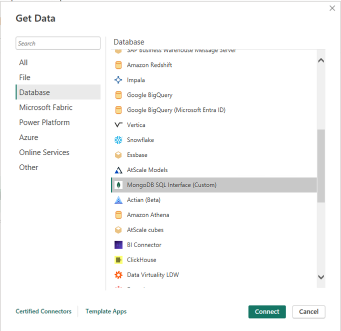
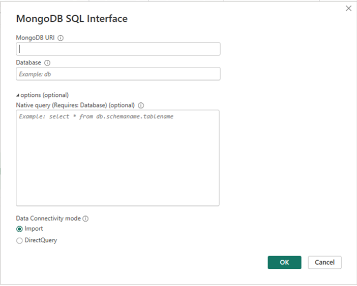
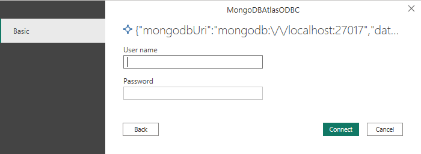
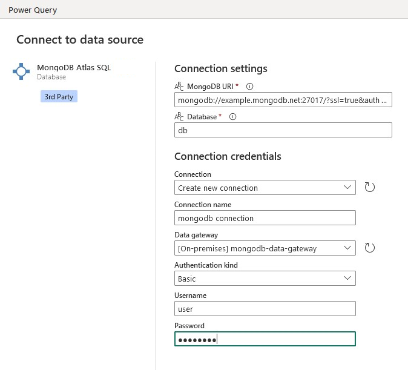
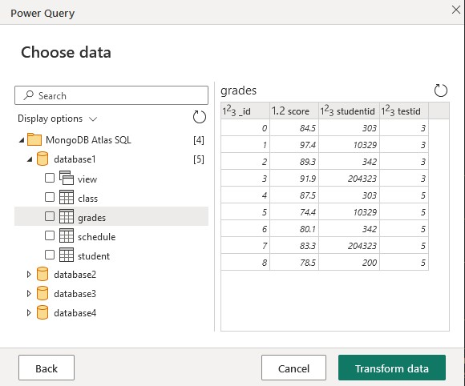

# MongoDB SQL Interface

> [!Note]
> This connector is owned and provided by MongoDB.

## Summary

| Item                           | Description                                                                                                       |
|--------------------------------|-------------------------------------------------------------------------------------------------------------------|
| Release State                  | General Availability                                                                                              |
| Products                       | Power BI (Semantic models) <br/> Power BI (Dataflows) <br/> Fabric (Dataflow Gen2)                                |
| Authentication Types Supported | Database (Username/Password) <br/> X.509 Certificates <br/> OAuth (OIDC) <br/> AWS Identity and Access Management |

> [!Note]
> When using authentication mechanisms other than Username/Password (such as X.509 Certificates, OAuth (OIDC), or AWS IAM), you can leave the username and password fields blank in the connection dialogue. The appropriate credentials will be handled through the chosen authentication method.

## Prerequisites
There are two ways to use the MongoDB SQL Interface: In Atlas (The Cloud) or Self-Managed (On-Premises). 
1. To use the MongoDB SQL Interface in Atlas, you must have an [Atlas federated database](https://www.mongodb.com/docs/atlas/data-federation/) setup. 
   - Here is the [MongoDB documentation to set up Power BI in Atlas](https://www.mongodb.com/docs/atlas/data-federation/query/connect-with-sql-composable/?deployment-type=atlas&sql-driver=power-bi) 
2. To use it Self-Managed, you must first create schemas with the [mongodb-schema-manager.exe](https://www.mongodb.com/try/download/sql-schema-builder).
   - Here is the [MongoDB documentation to set up Power BI on a Self-Managed cluster](https://www.mongodb.com/docs/atlas/data-federation/query/connect-with-sql-composable/?deployment-type=self&sql-driver=power-bi&os=windows).

### Obtaining connection information in Atlas

1. Navigate to your federated database instance. In Atlas, select **Data Federation** from the left navigation panel.
2. Select **Connect** to open the federated database instance connection modal.
3. Select **Atlas SQL**.
4. Select **Power BI Connector**.
5. Copy your federated database name and MongoDB URI. You'll need them in a later step.

> [!Note]
> If some or all of your data comes from an Atlas cluster, you must use MongoDB version 5.0 or greater for that cluster to take advantage of Atlas SQL.

### Obtaining connection information for Self-Managed systems
In this case, the connection information is maintained by your organization, so you'll have to work with them to get it.

### Install the ODBC driver and (optionally) the latest Power BI Connector
The [MongoDB Atlas SQL ODBC Driver](https://www.mongodb.com/try/download/odbc-driver) is required to use the MongoDB SQL Interface. You must download and install it.

Optionally, you can also download and install the latest [Power BI Connector](https://www.mongodb.com/try/download/power-bi-connector) if you wish to have the most up-to-date version.

> [!Note]
> There's lag time between MongoDB's latest Power BI Connector release and Microsoft supporting it natively in Power BI, so you may need to download the latest version for
> newer features/capabilities and bug fixes. 

## Capabilities Supported

* Import
* DirectQuery (Power BI semantic models)

## Connect using the MongoDB SQL Interface from Power Query Desktop

To connect using the MongoDB SQL interface:

1. Select **Get Data** from the **Home** ribbon in Power BI Desktop.

2. Select **Database** from the categories on the left, select **MongoDB SQL Interface**, and then select **Connect**.
> [!Note]
> If you installed a newer version of the Power BI connector, it might show as "MongoDB SQL Interface (Custom)" instead. 

   

3. If you're connecting to the MongoDB SQL Interface for the first time, a third-party notice is displayed. 
   Select **"Don't warn me again with this connector"** if you don't want this message to be displayed again.

   Select **Continue**. 

4. In the MongoDB SQL Interface window that appears, fill in the following values:

   - The **MongoDB URI**. _Required_ \
     Use the MongoDB URI obtained [in the prerequisites](#Prerequisites).  Make sure that it doesn't contain your username and password. URIs containing username and/or passwords are rejected.
   - Your **Database** name. _Required_ \
     If you're using Atlas, use the name of the federated database obtained [in the prerequisites](#Prerequisites). If you're self-managed, use the name of the database you'd like to connect to.
   - A SQL query. _Optional_ \
     Enter a native Atlas SQL query to execute immediately. If the **Database** is the same as above, you may omit it from the query.
     ```
     SELECT * FROM orders
     ```
   - Select either **Import** or **DirectQuery** for your desired Data Connectivity mode
   
   Select **OK**.  

   
   
5. Enter your Atlas MongoDB Database access username and password and select **Connect**.  

     

> [!Note]
> Once you enter your username and password for a particular database, Power BI Desktop uses those same credentials in subsequent connection attempts. You can modify those credentials by going to **File** > **Options and settings** > **Data source settings**.  

6. In **Navigator**, select one or multiple elements to import and use in Power BI Desktop. 
   Then select either **Load** to load the table in Power BI Desktop, or **Transform Data** to open the Power Query 
   editor where you can filter and refine the set of data you want to use, and then load that refined set of data into 
   Power BI Desktop.

## Connect using the MongoDB SQL interface from Power Query Online

To connect using the MongoDB SQL interface:

1. Select **MongoDB SQL Interface** from the **Power Query - Choose data source** page.
2. On the **Connection settings** page, fill in the following values:
    - The **MongoDB URI**. _Required_.   
      Use the MongoDB URI obtained [in the prerequisites](#Prerequisites).  Make sure that it doesn't contain your username and password. URIs containing username and/or passwords are rejected.
    - Your **Database** name. _Required_  
      If you're using Atlas, use the name of the federated database obtained [in the prerequisites](#Prerequisites). If you're self-managed, use the name of the database you'd like to connect to.

   

3. In the **Navigator** screen, select the data you require, and then select **Transform data**. This selection opens the Power Query editor so that you can filter and refine the set of data you want to use.  

   

## Troubleshooting

When a connection can't be established, the generic error message 
`The driver returned invalid (or failed to return) SQL_DRIVER_ODBC_VER: 03.80` is displayed.
Start by checking your credentials and that you have no network issues accessing your federated database.

## Next steps

You might also find the following information useful:
* [SQL Interface Overview](https://www.mongodb.com/docs/atlas/data-federation/query/connect-with-sql-overview/)
* [Query with the SQL Interface](https://www.mongodb.com/docs/atlas/data-federation/query/sql/query-with-asql-statements/)
* [Set Up and Query Data Federation](https://www.mongodb.com/docs/atlas/data-federation/)
* [Schema Management in Atlas Data Federation](https://www.mongodb.com/docs/atlas/data-federation/query/sql/schema-management/)
* [MongoSQL Language Reference](https://www.mongodb.com/docs/atlas/data-federation/query/sql/language-reference/)
* [MongoSQL Errors Guide](https://www.mongodb.com/docs/atlas/data-federation/query/sql/errors/)
